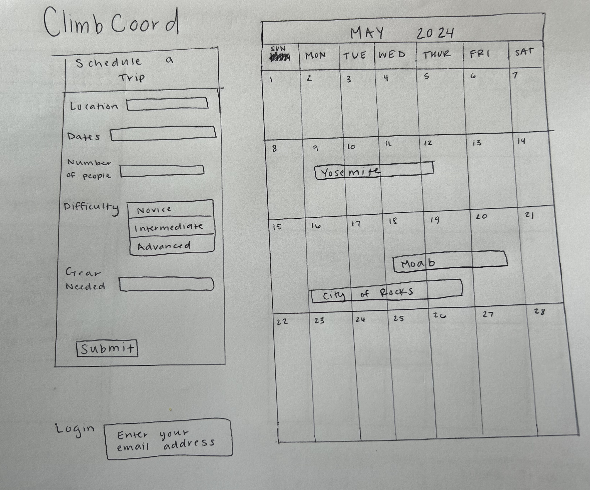
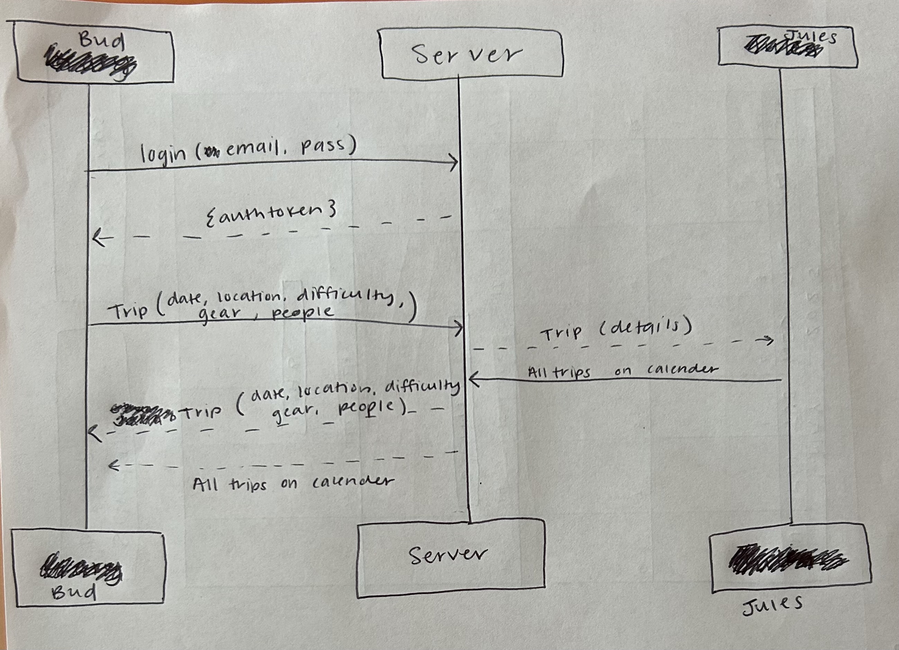

# ClimbCoord

## Elevator Pitch

Have dozens of climbing trips that have never made it out of the group chat? ClimbCoord is your new ultimate companion for seamless climbing adventures! ClimbCoord is a group calendering platform designed for passionate climbers to effortlessly plan their next ascent and join other's trips. Connect with fellow climbers, coordinate gear, and assess skill levels with ease. Whether you're a novice or a seasoned pro, our platform empowers you to meet new climbers and make your climbing goals a reality! Elevate your climbing experience with ClimbCoord!

## Design 

A diagram demonstrating how the server and backend would interact.

## Key Features
- Secure login over HTTPS
- A group calendar listing trips of connected friends. 
- A general description of each trip. 
- Listed details such as date, location, gear needed, number of people, and climb difficulty. 
- Ability to submit and delete trips. 

## Technologies

I am going to use the required technologies in the following ways.

**HTML** - Implements proper HTML structure for the application with two distinct pages – one dedicated to login and the other for submitting and viewing climbing trips. Includes hyperlinks for navigating between selected artifacts. Would display a calender view to make it easy for users to view. 

**CSS** - Employed to create a visually appealing and responsive interface, ensuring an immersive and user-friendly experience for climbers. 

**JavaScript** - Provides login, retirives details of trips, submits the trips, displays other scheduled trips, backend endpoint calls.

**Service** - Backend service with endpoints for:
- login
- retrieving location, dates, number of people, difficulty, amd needed gear
- submitting trips
- retrieving trips 

**DB/Login** - Store users and trip data in database. Register and login users by storing credentials securely in database. Can't plan a trip unless authenticated.

**WebSocket** - When a trip is submitted, it is visible to other users.

**React** - The application has been adapted to utilize the React web framework.

 

## HTML Deliverable
For this deliverable I built out the structure of my application using HTML.

- HTML pages - Three HTML pages that represent the ability to login, sumbit/view trips, and chat with other climbers. 
- Links: The login page automatically links to the other two pages.
- Text: Texts describing the calendar and input options are present. 
- Images:  There are two images representing the structure of the messaging and calendar system. 
- DB/Login:  Input box and submit button for login. There is a submission form for the details of the trip. The calendar represents the data that will be shown from the databased containing the information received from the submission form. 
- WebSocket: The chat feature represents the real time ability to chat with other climbers.

 

## CSS Deliverable 
For this deliverable I properly styled the application into its final appearance.

- Header, footer, and main content body: Made aeach element consistent across pages and appear appealing to the user. 
- Navigation elements: Designed a consistent nav bar that doesn't have the underlined word for the links. 
- Responsive to window resizing: The app looks great on different window sizes and devices. 
- Application elements - Used appealing colors that matched the outdoor aesthetic of rock climbing. 
- Application text content: Changed the fonts and size to emphasize key words. 

 

## JavaScript Deliverable
For this deliverable I properly styled the application into its final appearance.

- Login: handles the username and stores it in the localStorage API
- User display: displays the user across pages by retrieving it from the localStorage API. 
- Calender: handles the inpput for trip submissions. Stores and displays the data on a calender. 
- Chat: handles and displays the input responses for the chat aspect of the website. 

## Service Deliverable 

For this deliverable I added backend endpoints that receives trip sumbissions and displays them on a calendar. 

- Node.js/Express HTTP service
- Static middleware for frontend
- Calls to third party endpoints: Rotates through different pictures on the side of the chat for styling. 
- Backend service endpoints - Endpoints for submitting a trip. 
- Frontend calls service endpoints: I did this using the fetch function.

## Login Deliverable 
For this deliverable I created a database to store users login information.

- Created MongoDB Atlas database that stores login information.
- User registration - Creates a new account in the database.
- existing user - Stores trips under the same user.
- Restricts functionality - The submit a trip box will not be avaliable on the calendar page until you are logged in. Users not logged cannot submit a trip. 